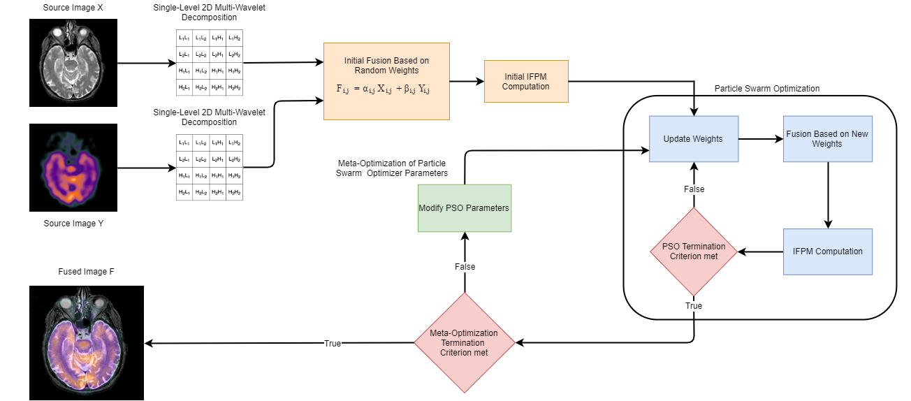

# Medical-Image-Fusion

This project looks to propose a new fusion rule applied on MRI and SPECT images using particle swarm optimization and image fusion performance metric (IFPM) to improve the information density of the fused image with respect to the original images for better medical diagnosis. The results obtained are compared using entropy (EN) and mutual information (MI). The proposed fusion model shows higher values for IFPM as well as MI. From the results, it can be inferred that the proposed method improved the information content, which may lead to better decision for diagnosis.